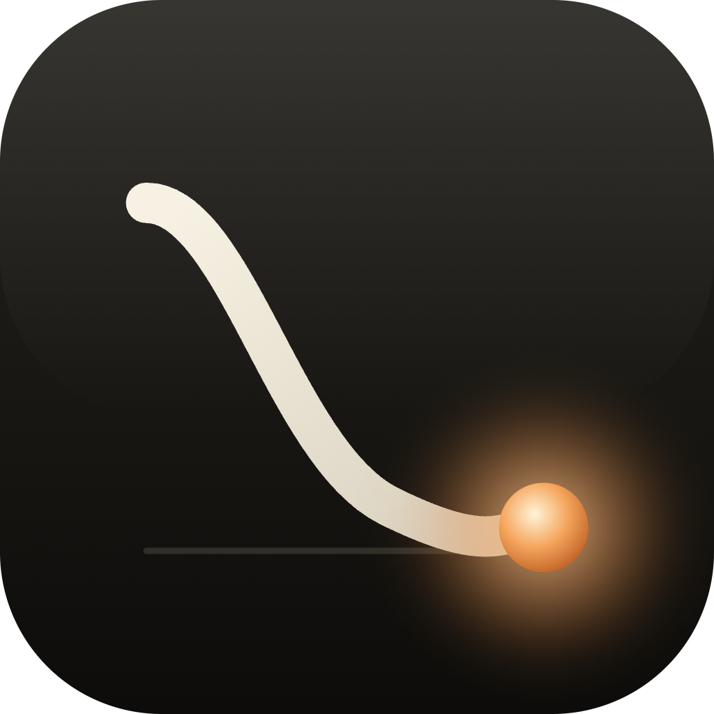

# GradientForge

  **Neural networks you can see. Train on your Mac, visualize what the network learned, and export to Core ML in one click — no code required.**

  GradientForge is a native macOS app for training and visualizing neural networks. It's built for students learning how neural networks work, educators who need a visual teaching
  tool, and iOS/macOS developers prototyping Core ML models — all without writing code.

  ---

  ## Need help?

  - 📘 [Frequently Asked Questions](#frequently-asked-questions) — below on this page
  - 🐞 [Report a bug or request a feature](https://github.com/YOUR_USERNAME/GradientForge/issues)
  - ✉️  Email **celtichammer01@gmail.com** — replies within a few business days
  - 📖 Open the in-app User Guide (Help menu → User Guide)

  ---

  ## Contents

  - [Requirements](#requirements)
  - [Getting started](#getting-started)
  - [Frequently Asked Questions](#frequently-asked-questions)
  - [Reporting bugs](#reporting-bugs)
  - [Privacy](#privacy)

  ---

  ## Requirements

  - **macOS 26 (Tahoe) or later**
  - Apple Silicon Mac

  ---

  ## Getting started

  1. Install GradientForge from the [Mac App Store](https://apps.apple.com/app/idYOURAPPID)
  2. Launch the app — the Iris dataset is loaded by default
  3. Click **Run** in the toolbar to train your first network (about 20 seconds)
  4. Explore the results — loss and accuracy charts, the confusion matrix, and the architecture diagram
  5. Click **Export Core ML…** to save the trained model as a `.mlmodel` file

  For deeper guidance on hyperparameter tuning, dataset import, and Core ML deployment, open **Help → User Guide** inside the app.

  ---
  
  ## Frequently Asked Questions

  ### What does GradientForge do?

  GradientForge lets you train and visualize neural networks on your Mac without writing code. You can pick from built-in datasets or import your own, adjust hyperparameters with
  on-screen controls, and see how the network learns through interactive charts and diagrams. Trained models can be exported as Core ML files for use in your own iOS, iPadOS, macOS,
  watchOS, or visionOS apps.
  
  ### What are the system requirements?

  GradientForge requires **macOS 26 (Tahoe) or later** and an Apple Silicon Mac.

  ### Does GradientForge collect any data or require an internet connection?
  
  No. GradientForge runs entirely offline. It does not collect, transmit, or share any personal information, datasets, or training results. All of your data stays on your Mac. You
  can use the app without ever connecting to the internet.

  ### What file formats can I import as datasets?

  You can import datasets in two formats:

  - **CSV** — comma-separated values with input features and output values in each row. You'll be asked how many columns are inputs vs. outputs during import.
  - **JSON** — GradientForge's native format, which preserves dataset metadata (input/output names, recommended architecture, output activation). This is the format used when you
  export a custom dataset for sharing or backup.

  ### Where are my custom datasets stored?
  
  Custom datasets are saved inside the app's sandboxed Application Support folder. You can also export any custom dataset as a JSON file (via **Dataset Editor → Export**) to back it
  up, share it, or move it to another Mac.

  ### How do I export a trained model to Core ML?

  1. Train a model on any dataset
  2. Click **Export Core ML…** in the toolbar
  3. Fill in optional metadata (model name, author, description, license)
  4. Save the `.mlmodel` file wherever you'd like

  GradientForge automatically runs a **parity check** on the saved file — see the next question.

  ### What's the Core ML parity check?

  After every Core ML export, GradientForge loads the saved `.mlmodel` file from disk, feeds it the same test inputs as your in-app model, and verifies that both produce identical
  predictions. If the predictions match, you'll see a green confirmation. If they don't, the sheet shows where they diverge so you can troubleshoot. The check is automatic — you
  don't need to enable anything.
  
  ### Can I use the exported model in my iOS or macOS app?

  Yes. Drag the `.mlmodel` file into your Xcode project and it will be compiled automatically. Apple's Core ML framework handles inference on iOS, iPadOS, macOS, watchOS, tvOS, and
  visionOS. GradientForge exports models using standard Core ML neural network layers, so no special runtime is required.

  ### My training accuracy is low. What should I try?

  A few things to check:

  - **Train for more epochs.** The default epoch count is a starting point; complex datasets often need 300–1000 epochs.
  - **Lower the learning rate.** Try 0.02 or 0.01 if training looks unstable.
  - **Switch optimizer.** Adam is a good default; SGD often converges to a better final point with momentum 0.9.
  - **Check your output activation matches the task** — Sigmoid for binary classification, SoftMax for multi-class, None for regression.
  - **Confirm your inputs are rescaled** — Z-score is enabled by default and usually correct.
  - **Use Compare Optimizers** to see whether the issue is the optimizer or the architecture.

  The built-in user guide (**Help → User Guide**) walks through hyperparameter tuning in detail.

  ### What's the difference between SGD, Adam, and RMSProp?

  All three are optimization algorithms that decide how the network's weights get updated each step.
  
  - **SGD** (with momentum) — classic, predictable, often the best final accuracy if tuned carefully
  - **Adam** — adaptive learning rates per parameter, usually the fastest to converge and the best default
  - **RMSProp** — also adaptive, similar to Adam without the momentum term, sometimes more stable on noisy data
  
  Use the **Compare Optimizers** feature to train all three in parallel on your data and see which works best.

  ### Can I get a refund?

  Refunds are handled by Apple, not by GradientForge. To request one, visit [reportaproblem.apple.com](https://reportaproblem.apple.com) and sign in with the Apple ID used to
  purchase. Apple typically processes refund requests within 48 hours.

  ---

  ## Reporting bugs

  For bug reports or feature requests, please [open an issue](https://github.com/YOUR_USERNAME/GradientForge/issues) or email **[your email]**.

  When reporting a bug, please include:
  
  - Your macOS version (Apple menu → About This Mac)
  - The GradientForge version (in the app's About panel)
  - A short description of what happened
  - Steps to reproduce, if possible
  - A screenshot, if relevant
  
  I read every message and reply within a few business days.

  ---
  
  ## Privacy

  GradientForge does not collect, transmit, or share any data. All datasets, trained models, and exported files remain on your Mac.

  See the full [Privacy Policy](privacy.md) for details.
  
  ---

  © 2026 Thomas Crampton. GradientForge is a registered trademark. The contents of this page are licensed for reference only.
